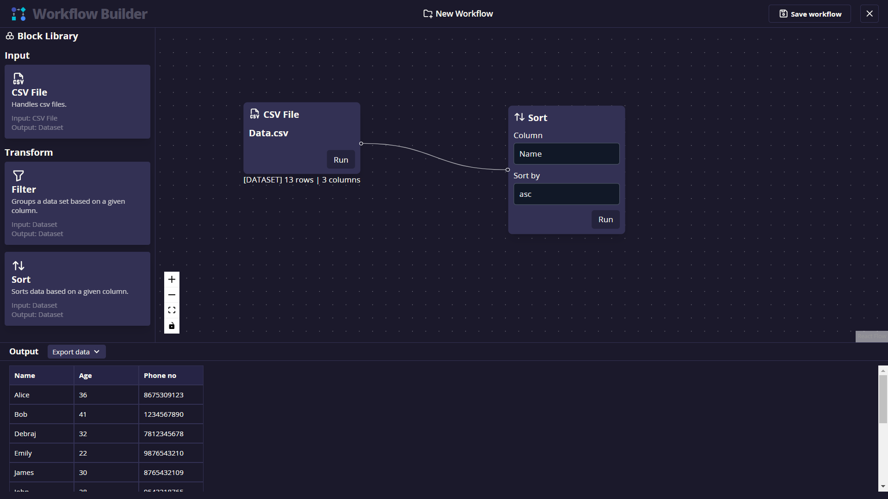
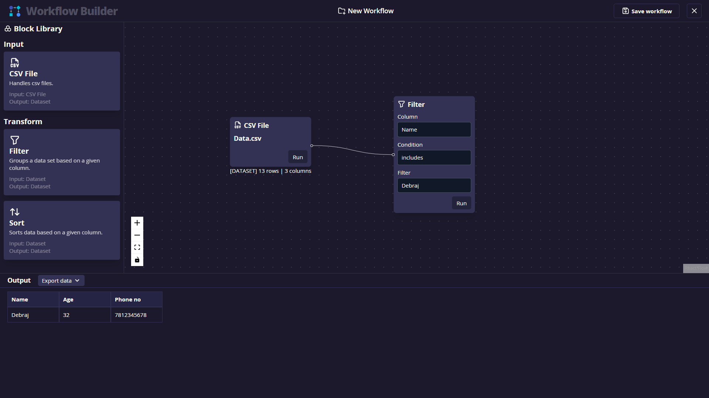

# Drag & Drop workflow builder

🌐 Website : [wbuilder](https://wbuilder.vercel.app/)

## 📑Project Description

    Create a Workflow Builder application where users can create, edit, and visualize different workflows. Each workflow consists of multiple steps (nodes) and the relationships (edges) between them. Users should be able to drag and drop different types of nodes (e.g., filter, find, reduce, map, array methods) onto a canvas, and then draw lines between them to represent the workflow.

    Task is to create a workflow building that performs dynamic operations on large amounts of data. You will have multiple CSVs in your local project. User can perform various operations on data to see final result on the CSV user has selected. This CSV might contain million records too.





<br/>

## 👨🏻‍💻 Developer's Talk
Developed by <a href="https://github.com/debrajhyper">Debraj Karmakar</a>
<span style="display:inline-flex; justify-content:space-evenly; width:20%;">
<a href="https://twitter.com/debraj_010">
  
</a>
<a href="https://www.linkedin.com/in/debrajkarmakar010/">
  
</a>
</span>

>Just wrapped up <a href="https://wbuilder.vercel.app/">Workflow Builder</a>, a React& Redux advance project. A compact journey with big learnings. From UI design to workflow canvas state management, faced challenges that shaped my skills as a front-end dev.

<br/>

## 🚀 Tech Stack

- HTML5
- CSS3
- Vite
- React
- Typescript
- React Flow
- React Hooks
- React Redux
- React Router
- Tailwind CSS
- Redux Toolkit
- Tabler Icons
- React Resizable Panels

<br/>

## 📁Folder Structure
```typescript
├───data
├───public
├───src
│   ├───app
│   ├───assets
│   ├───components
│   │   ├───BlockLibrary
│   │   ├───Canvas
│   │   │   └───customNodes      
│   │   ├───Header
│   │   ├───Table
│   │   └───WorkflowCard
│   ├───constants
│   ├───hooks
│   ├───layout
│   ├───routes
│   ├───services
│   ├───utils
│   └───view
│       ├───Home
│       ├───NoMatchFound
│       └───WorkflowBuilder
└───template
```
<br/>

## 🔐Key Features

- [✔] The dashboard will display all the workflows user has created. Users can either create a new workflow or edit the existing one.
- [✔] The user will be represented with a blank canvas.
- [✔] In the left panel,
    - there will be options to choose CSV data to perform operations on. (These CSVs will reside in the local project folder).
    - These CSV data will be input of the next node.
    - there will be nodes which represents Array methods such as filter, map, find etc.
- [✔] User will select any node and will drop in canvas and will take few required inputs such as,
    - in sort method, column name & order
    - in filter method,
        - column name,
        - condition (is equal, is not equal to, includes, does not include)
        - value (this will be dynamically shown based on condition type selection)
    - And in such way many other methods…..
- [✔] All these blocks should be connected via each other and output of this block should be passed to the next connected block and should perform operation only on the previous node’s output data.
- [✔] There should be “Run” button inside every block and upon clicking it, final output should be shown in table format in bottom panel (which should be collapsible)
- [✔] These data should be option to “Export data” in json or in CSV format again.
- [✔] There will be “Save workflow” button on header. By clicking it that workflow along with its unique name should be stored in web storage (localStorage or indexedDB whichever you prefer)
- [✔] The application should handle large data efficiently and demonstrate good performance.

<br/>

## ✅Acceptance Criteria

1. [✅] The application is built using React and related technology stack (Redux, React-Router, etc).
2. [✅] The workflow builder uses [React Flow](https://reactflow.dev/) and provides a seamless user experience.
3. [✅] Components are well-structured and properly organized.
4. [✅] State management is handled efficiently using Redux and context API.
5. [✅] You need to use Redux-toolkit for state management if you plan to use it.
6. [✅] React hooks are used where necessary.
7. [✅] React best practices are followed.
8. [✅] Proper error handling is implemented.
9. [✅] Proper use of async operations and Promises.
10. [✅] The code is clean, well-structured, and follows a recognized style guide ``(Airbnb's style guide)``.
11. [✅] Code should run with eslint enabled.
12. [✅] Error messages should be proper along with fallback UI where there are no data.
13. [✅] Runtime UI crashes are not allowed, even if it happens anyhow, It should have a fallback UI  with a gradient background and error message texts upon it which should be clearly readable.

<br/>

## 🏃🏻‍♂️ Run Locally

Clone the project
```
  $git clone https://github.com/debrajhyper/workflow-builder.git
```

Go to the project directory
```
  cd workflow-builder
```

Install dependencies
```
  $npm install
```

Start the dev server
```
  $npm run dev
```

<br/>